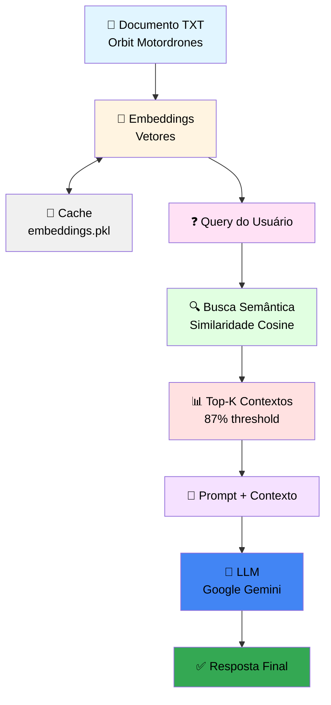

# 🚀 42 São Paulo: Imersão GenAI para Desenvolvedores

Repositório contendo todos os projetos e exercícios desenvolvidos durante a Imersão GenAI para Desenvolvedores na 42 São Paulo.

## 📋 Índice

- [Sobre a Imersão](#-sobre-a-imersão)
- [Projetos](#-projetos)
  - [Project 1 - Fundamentos de Python](#project-1---fundamentos-de-python)
  - [Project 2 - Engenharia de Prompts e LLMs](#project-2---engenharia-de-prompts-e-llms)
  - [Project 3 - Chatbots Avançados e RAG](#project-3---chatbots-avançados-e-rag)
  - [Rush GenAI](#rush-genai)
- [Tecnologias Utilizadas](#-tecnologias-utilizadas)
- [Aprendizados](#-aprendizados)
- [Autor](#-autor)
- [Licença](#-licença)
- [Agradecimentos](#-agradecimentos)


---

## 🎯 Sobre a Imersão

A **Imersão GenAI para Desenvolvedores** é um programa intensivo oferecido pela **42 São Paulo** focado em Inteligência Artificial Generativa. Durante a imersão, foram desenvolvidos **4 projetos completos** (3 módulos + 1 rush final) explorando tecnologias de ponta e conceitos fundamentais de IA:

### 🎓 Módulos e Aprendizados

- **🐍 Módulo 1 - Fundamentos de Python**: 9 exercícios práticos de Python essenciais
- **🧠 Módulo 2 - Engenharia de Prompts**: 7 exercícios de técnicas avançadas de prompting
- **🤖 Módulo 3 - Chatbots e RAG**: 4 exercícios de sistemas conversacionais inteligentes
- **🚀 Rush Final**: Projeto completo de chatbot com ChromaDB e Streamlit

### 💡 Tecnologias Exploradas

- 🤖 **Large Language Models (LLMs)** - Google Gemini 2.5 Flash Lite
- 💬 **Chatbots Inteligentes** - Persistência, memória e roteamento
- 🗄️ **Bancos de Dados Vetoriais** - ChromaDB com embeddings multilinguais
- 🔍 **Sistemas RAG** - Retrieval Augmented Generation completo
- 🧭 **Roteamento Inteligente** - Dual-LLM architecture
- � **Function Calling** - Integração de funções com LLMs
- �🐳 **Containerização** - Docker e Ollama
- 🎨 **Interfaces Web** - Streamlit para aplicações interativas
- 🗃️ **Persistência** - SQLAlchemy 2.0 e SQLite
- ✅ **Validação** - Pydantic schemas e type hints

---

## 📂 Projetos

### Project 1 - Fundamentos de Python

> **Status:** ✅ Completo
> **Repositório:** [EvertonVaz/project1](https://github.com/EvertonVaz/project1)

Módulo introdutório focado nos **fundamentos de Python**, essencial para o desenvolvimento de aplicações com IA Generativa. Contém 9 exercícios práticos progressivos que cobrem desde conceitos básicos até integração com APIs externas.

#### 📚 Exercícios Implementados

<details>
<summary><b>ex01 - Variáveis e Strings</b></summary>

- **Conceitos:** Declaração de variáveis, interpolação com f-strings
- **Arquivo:** `ex01/name.py`
- **Aprendizado:** Trabalhar com tipos básicos e formatação de texto
</details>

<details>
<summary><b>ex02 - Operadores Booleanos</b></summary>

- **Conceitos:** Operadores de comparação (==, >, <)
- **Arquivo:** `ex02/boolean.py`
- **Aprendizado:** Expressões booleanas e comparações
</details>

<details>
<summary><b>ex03 - Listas</b></summary>

- **Conceitos:** Estruturas de dados, iteração com `for`
- **Arquivo:** `ex03/lists.py`
- **Aprendizado:** Manipulação de listas e loops
</details>

<details>
<summary><b>ex04 - Dicionários</b></summary>

- **Conceitos:** Estruturas chave-valor, iteração sobre dicts
- **Arquivo:** `ex04/dicts.py`
- **Aprendizado:** Trabalhar com dicionários e seus métodos
</details>

<details>
<summary><b>ex05 - Argumentos de Linha de Comando</b></summary>

- **Conceitos:** `sys.argv`, captura de argumentos CLI
- **Arquivo:** `ex05/arguments.py`
- **Aprendizado:** Processar entradas via terminal
</details>

<details>
<summary><b>ex06 - Primeira Função</b></summary>

- **Conceitos:** Definição de funções, parâmetros padrão, type hints
- **Arquivo:** `ex06/first_function.py`
- **Aprendizado:** Criar funções reutilizáveis com tipagem
</details>

<details>
<summary><b>ex07 - Saudações da Fazenda</b></summary>

- **Conceitos:** Bibliotecas externas, gerenciamento de dependências
- **Arquivo:** `ex07/greetings_from_the_farm.py`
- **Biblioteca:** `cowsay` (ASCII art)
- **Aprendizado:** Usar `requirements.txt` e bibliotecas de terceiros
</details>

<details>
<summary><b>ex08 - Consulta de Clima</b></summary>

- **Conceitos:** Requisições HTTP, APIs REST, manipulação de JSON
- **Arquivo:** `ex08/weather.py`
- **API:** Open-Meteo (gratuita, sem autenticação)
- **Biblioteca:** `requests`
- **Aprendizado:** Integração com APIs externas
</details>

<details>
<summary><b>ex09 - Documentação</b></summary>

- **Conceitos:** Documentação de código
- **Arquivo:** `ex09/README.md`
- **Aprendizado:** Boas práticas de documentação
</details>

#### 🎯 Objetivos de Aprendizado

- ✅ **Fundamentos Python:** Variáveis, tipos de dados, estruturas de controle
- ✅ **Estruturas de Dados:** Listas, dicionários e iteração
- ✅ **Funções:** Definição, parâmetros, type hints e boas práticas
- ✅ **CLI:** Processamento de argumentos de linha de comando
- ✅ **Dependências:** Gerenciamento com `requirements.txt`
- ✅ **APIs REST:** Requisições HTTP e manipulação de JSON
- ✅ **Boas Práticas:** Documentação, organização de código

#### 🚀 Como Executar

```bash
cd project1

# Exercícios básicos (ex01-ex06)
python ex01/name.py
python ex02/boolean.py
python ex03/lists.py

# Exercícios com dependências
pip install cowsay requests
python ex07/greetings_from_the_farm.py Everton
python ex08/weather.py "São Paulo"
```

---

### Project 2 - Engenharia de Prompts e LLMs

> **Status:** ✅ Completo
> **Repositório:** [EvertonVaz/project2](https://github.com/EvertonVaz/project2)

Módulo avançado focado em **Engenharia de Prompts** e integração com **Large Language Models (LLMs)**. Explora técnicas profissionais de prompting, desde conceitos básicos até estratégias avançadas como Few-Shot Learning, XML Prompting, Role-Play e Prompt Chaining.

#### 📚 Exercícios Implementados

<details>
<summary><b>ex01 - Provedor de API</b></summary>

- **Conceitos:** Escolha de provedor LLM, API Keys, Rate Limits
- **Arquivo:** `ex01/provider.txt`
- **Provedor:** Google Gemini API
- **Aprendizado:**
  - Processo de obtenção de API Key
  - Compreensão de limites (RPM, TPM, RPD)
  - Modelos disponíveis (Gemini 2.5 Pro, Flash, Flash-Lite)
</details>

<details>
<summary><b>ex02 - Primeiro Prompt</b></summary>

- **Conceitos:** Requisições básicas à API, controle de temperatura
- **Arquivo:** `ex02/prompt.py`
- **Tecnologias:** Google Gemini API, python-dotenv
- **Funcionalidades:**
  - Envio de prompts via linha de comando
  - Controle de temperatura (0.0 - 2.0)
  - Tratamento de erros
- **Aprendizado:** Integração básica com LLM e parâmetros de geração
</details>

<details>
<summary><b>ex03 - Few-Shot Learning</b></summary>

- **Conceitos:** Few-Shot Prompting, exemplos contextuais
- **Arquivo:** `ex03/fewshot.py`
- **Técnica:** Fornecer exemplos para guiar o modelo
- **Caso de Uso:** Definição de termos de informática
- **Exemplos fornecidos:**
  - SQL → linguagem de consulta estruturada
  - Python → linguagem de programação de alto nível
  - API → conjunto de definições e protocolos
  - HTTP → protocolo de transferência de hipertexto
- **Aprendizado:** Como ensinar o modelo através de exemplos
</details>

<details>
<summary><b>ex04 - XML Prompting</b></summary>

- **Conceitos:** Estruturação de prompts com XML, templates
- **Arquivo:** `ex04/xml.py`
- **Técnica:** Uso de tags XML para organizar instruções
- **Caso de Uso:** Resumidor de texto (máx. 20 palavras)
- **Estrutura:**
  - `<instructions>`: Diretrizes claras
  - `<exemplos>`: Exemplos de entrada/saída
  - `<texto>`: Conteúdo a processar
- **Aprendizado:** Prompts estruturados melhoram consistência
</details>

<details>
<summary><b>ex05 - Role-Play</b></summary>

- **Conceitos:** Definição de persona, simulação de especialistas
- **Arquivo:** `ex05/roleplay.py`
- **Técnica:** Atribuir papel específico ao modelo
- **Persona:** Consultor de viagens especializado
- **Caso de Uso:** Listar top 5 destinos turísticos por região
- **Estrutura:**
  - `<persona>`: Definição do papel
  - `<instruções>`: Tarefas específicas
  - `<exemplos>`: Paris, Floresta Amazônica
- **Aprendizado:** Personas direcionam o tom e expertise das respostas
</details>

<details>
<summary><b>ex06 - Structured Output</b></summary>

- **Conceitos:** Saída estruturada, validação com Pydantic
- **Arquivo:** `ex06/structured.py`
- **Tecnologias:** Pydantic BaseModel, JSON Schema
- **Caso de Uso:** Extração de informações de pessoa
- **Schema:**
  ```python
  class Pessoa(BaseModel):
      nome: str
      idade: int
      profissão: str
      cidade: str
  ```
- **Aprendizado:** Garantir formato consistente e validado das respostas
</details>

<details>
<summary><b>ex07 - Prompt Chaining</b></summary>

- **Conceitos:** Encadeamento de prompts, pipeline de processamento
- **Arquivo:** `ex07/chaining.py`
- **Técnica:** Usar output de um prompt como input do próximo
- **Pipeline:**
  1. **Expansão:** Gera descrição detalhada do produto (~50 palavras)
  2. **Criatividade:** Converte em anúncio publicitário com emojis
  3. **Tradução:** Traduz resultado final para inglês
- **Aprendizado:** Dividir tarefas complexas em etapas simples
</details>

#### 🎯 Objetivos de Aprendizado

- ✅ **API Integration:** Configuração e uso do Google Gemini API
- ✅ **Prompt Engineering:** Técnicas profissionais de construção de prompts
- ✅ **Few-Shot Learning:** Ensinar modelos através de exemplos
- ✅ **Structured Prompting:** XML e formatação para melhor controle
- ✅ **Role-Playing:** Definição de personas para contexto especializado
- ✅ **Output Validation:** Schemas Pydantic para respostas estruturadas
- ✅ **Prompt Chaining:** Pipelines de processamento multi-etapa
- ✅ **Temperature Control:** Ajuste de criatividade vs. determinismo
- ✅ **Error Handling:** Tratamento robusto de exceções

#### 🛠️ Tecnologias

- **LLM:** Google Gemini 2.5 Flash
- **SDK:** `google-genai` (oficial)
- **Validação:** Pydantic BaseModel
- **Ambiente:** python-dotenv
- **Containerização:** Docker Compose (Ollama local)

#### 🚀 Como Executar

```bash
cd project2

# Configurar API Key
echo "GOOGLE_API_KEY=sua_chave_aqui" > .env

# Instalar dependências
pip install -r requirements.txt

# Executar exercícios
python ex02/prompt.py "Explique IA em uma frase" 1.0
python ex03/fewshot.py "Docker"
python ex04/xml.py "A fotossíntese é o processo pelo qual plantas convertem luz solar em energia"
python ex05/roleplay.py "Tokyo"
python ex06/structured.py "João Silva, 35 anos, é engenheiro e mora em SP"
python ex07/chaining.py "Smartphone com câmera 108MP"

# Ollama local (opcional)
docker-compose up -d
```

#### 📊 Rate Limits - Google Gemini (Free Tier)

| Modelo | RPM | TPM | RPD |
|--------|-----|-----|-----|
| Gemini 2.5 Pro | 5 | 125.000 | 100 |
| Gemini 2.5 Flash | 10 | 250.000 | 250 |
| Gemini 2.5 Flash-Lite | 15 | 250.000 | 1.000 |
| Gemini 2.0 Flash | 15 | 1.000.000 | 200 |
| Gemini 2.0 Flash-Lite | 30 | 1.000.000 | 200 |

*RPM = Requests Per Minute | TPM = Tokens Per Minute | RPD = Requests Per Day*

---

### Project 3 - Chatbots Avançados e RAG

> **Status:** ✅ Completo
> **Repositório:** [EvertonVaz/project3](https://github.com/EvertonVaz/project3)

Módulo avançado focado em **Chatbots com Memória** e **Retrieval Augmented Generation (RAG)**. Explora conceitos de persistência de conversas, embeddings vetoriais, busca semântica e sistemas RAG completos.

#### 📚 Exercícios Implementados

<details>
<summary><b>ex01 - Chatbot Básico com Histórico</b></summary>

- **Conceitos:** Chatbot conversacional, histórico em memória
- **Arquivo:** `ex01/chatbot.py`
- **Funcionalidades:**
  - Loop de conversação interativo
  - Histórico das últimas 5 mensagens
  - Respostas concisas (máx. 10 palavras)
  - Comando `bye` para encerrar
- **Tecnologias:** Google Gemini Flash Lite
- **Aprendizado:** Gerenciamento básico de contexto conversacional
</details>

<details>
<summary><b>ex02 - Chatbot Persistente com Banco de Dados</b></summary>

- **Conceitos:** Persistência de conversas, resumos automáticos, arquitetura modular
- **Arquivos:**
  - `persistent_chatbot.py` - Lógica principal do chatbot
  - `database.py` - Repositório e acesso ao banco
  - `models.py` - Modelos SQLAlchemy (Message, Summary)
  - `schemas.py` - Schemas Pydantic para validação
- **Funcionalidades:**
  - ✅ **Persistência:** SQLite para histórico permanente
  - ✅ **Resumos Automáticos:** Geração a cada 10 mensagens
  - ✅ **Contexto Inteligente:** Últimas 5 mensagens + resumos
  - ✅ **Persona Definida:** Assistente empático e prestativo
  - ✅ **Respostas Concisas:** Máximo 25 palavras
- **Arquitetura:**
  ```
  ex02/
  ├── persistent_chatbot.py  # Classe PersistentChatbot
  ├── database.py            # MessageRepository
  ├── models.py              # Message, Summary (SQLAlchemy)
  └── schemas.py             # MessageData, SummaryData (Pydantic)
  ```
- **Tecnologias:** SQLAlchemy, Pydantic, SQLite
- **Aprendizado:** Arquitetura robusta com separação de responsabilidades
</details>

<details>
<summary><b>ex03 - Embeddings e Similaridade Semântica</b></summary>

- **Conceitos:** Embeddings vetoriais, busca por similaridade
- **Arquivo:** `ex03/embeddings.py`
- **Modelo:** `paraphrase-multilingual-MiniLM-L12-v2`
- **Funcionalidades:**
  - Geração de embeddings para textos em português
  - Cálculo de similaridade cosine
  - Busca dos top-3 textos mais similares
  - Dataset com 14 frases de diferentes tópicos
- **Exemplo de Uso:**
  ```bash
  python ex03/embeddings.py "inteligência artificial"
  # Retorna: frases sobre IA, tecnologia, Python
  ```
- **Aprendizado:** Fundamentos de busca semântica e embeddings
</details>

<details>
<summary><b>ex04 - Sistema RAG Completo</b></summary>

- **Conceitos:** Retrieval Augmented Generation, cache de embeddings
- **Arquivo:** `ex04/rag.py`
- **Dataset:** `orbit_motordrones.txt` (documento sobre VAPs)
- **Funcionalidades:**
  - 🔍 **Busca Semântica:** Recupera linhas relevantes do documento
  - 💾 **Cache Inteligente:** Salva embeddings em disco (pickle)
  - 🎯 **Threshold Dinâmico:** Filtra por 87% da similaridade máxima
  - 🤖 **Geração Aumentada:** LLM responde com contexto recuperado
- **Pipeline RAG:**
  1. **Indexação:** Gera embeddings de todas as linhas do documento
  2. **Retrieval:** Busca linhas similares à query do usuário
  3. **Augmentation:** Injeta contexto no prompt
  4. **Generation:** LLM responde baseado no contexto
- **Otimizações:**
  - Cache persistente de embeddings (evita reprocessamento)
  - Threshold adaptativo para melhor precisão
  - Temperatura baixa (0.4) para respostas factuais
- **Exemplo de Uso:**
  ```bash
  python ex04/rag.py "Qual o preço do Orbit Family?"
  # RAG recupera informações de preço e responde
  ```
- **Aprendizado:** Implementação completa de sistema RAG profissional
</details>

<details>
<summary><b>📊 Arquitetura do Sistema RAG</b></summary>



</details>

#### 🎯 Objetivos de Aprendizado

- ✅ **Chatbot Conversacional:** Loop de interação e gestão de contexto
- ✅ **Persistência de Dados:** SQLAlchemy com SQLite
- ✅ **Arquitetura Modular:** Separação de camadas (chatbot, database, models, schemas)
- ✅ **Resumos Automáticos:** Compactação inteligente de histórico
- ✅ **Embeddings Vetoriais:** Representação numérica de textos
- ✅ **Busca Semântica:** Similaridade cosine e ranking
- ✅ **Sistema RAG:** Retrieval + Augmented Generation completo
- ✅ **Cache Optimization:** Persistência de embeddings para performance
- ✅ **Threshold Tuning:** Ajuste fino de relevância
- ✅ **Persona Design:** Definição de tom e comportamento do assistente

#### 🛠️ Tecnologias

- **LLM:** Google Gemini 2.5 Flash Lite
- **Embeddings:** Sentence-Transformers (`paraphrase-multilingual-MiniLM-L12-v2`)
- **ORM:** SQLAlchemy 2.0
- **Validação:** Pydantic BaseModel
- **Database:** SQLite
- **Cache:** Pickle (serialização Python)
- **ML Framework:** PyTorch (via sentence-transformers)

#### 🚀 Como Executar

```bash
cd project3

# Configurar API Key
echo "GOOGLE_API_KEY=sua_chave_aqui" > .env

# Instalar dependências (inclui PyTorch)
pip install -r requirements.txt

# ex01 - Chatbot básico
python ex01/chatbot.py
# Digite suas perguntas. Digite 'bye' para sair.

# ex02 - Chatbot persistente
cd ex02
python persistent_chatbot.py
# Conversas são salvas em chat_history.db

# ex03 - Teste de embeddings
cd ../ex03
python embeddings.py "tecnologia"
python embeddings.py "futebol"
python embeddings.py "natureza"

# ex04 - Sistema RAG
cd ../ex04
python rag.py "Quais são os modelos da Orbit?"
python rag.py "Qual o preço do Orbit Family?"
python rag.py "Quem é o CEO da Orbit?"
```

#### 💡 Destaques Técnicos

**ex02 - Chatbot Persistente:**
- Repository Pattern para abstração de dados
- Resumos gerados automaticamente com prompt XML estruturado
- Gestão inteligente de contexto (histórico + resumos)
- Schemas Pydantic garantem validação de tipos

**ex04 - Sistema RAG:**
- Cache persistente evita reprocessamento (speedup ~100x)
- Threshold adaptativo: 87% da max similarity
- Modelo multilingual suporta português naturalmente
- Temperature 0.4 para respostas mais factuais

---

### Rush GenAI

> **Status:** ✅ Completo
> **Repositório:** [EvertonVaz/rush_genai](https://github.com/EvertonVaz/rush_genai)

Projeto principal da imersão: **Locadora** 👵🎬 - Um chatbot inteligente de recomendação de filmes com sistema de roteamento e RAG.

#### 🎬 Sobre o Projeto

Sistema completo de recomendação de filmes utilizando IA Generativa, banco de dados vetorial (ChromaDB) e persistência de conversas. O chatbot combina **roteamento inteligente** de conversas, **busca semântica**, **function calling** e **gestão avançada de contexto** para proporcionar recomendações personalizadas e gerenciar preferências do usuário.

#### ⚡ Funcionalidades Principais

- **🧭 Roteamento Inteligente**: Sistema que classifica intenção (`friendly` ou `movie_suggestion`)
- **💬 Chatbot Conversacional**: Interface natural com histórico de conversas persistente
- **🔍 Sistema RAG**: Retrieval Augmented Generation com ChromaDB para busca semântica
- **📊 Embeddings**: Sentence Transformers (`paraphrase-multilingual-MiniLM-L12-v2`)
- **💾 Persistência Completa**: SQLite para mensagens, resumos e favoritos
- **📝 Resumos Automáticos**: Geração a cada 10 mensagens (max 120 palavras)
- **⭐ Sistema de Favoritos**: Adicionar, avaliar e marcar filmes assistidos
- **🎯 Function Calling**: 7 funções integradas ao LLM
- **🎨 Interface Streamlit**: Container de chat com altura fixa (300px)
- **⏱️ Medição de Performance**: Decorator para tracking de tempo de execução

#### 🛠️ Stack Tecnológica

- **LLM**: Google Gemini 2.5 Flash Lite
- **Embeddings**: Sentence Transformers (modelo multilingual)
- **Vector DB**: ChromaDB (persistente)
- **ORM**: SQLAlchemy 2.0
- **Validação**: Pydantic BaseModel
- **Frontend**: Streamlit
- **Database**: SQLite

#### 📁 Arquitetura Modular

```
rush_genai/
├── chatbot/
│   ├── chatbot.py           # Classe ChatBot (LLM + Function Calling)
│   ├── database.py          # MessageRepository + UserRepository
│   ├── models.py            # Message, Summary, Favorites (SQLAlchemy)
│   ├── schemas.py           # ResponseData, PromptData, Movie (Pydantic)
│   ├── prompts.py           # PromptGenerator (roteamento, friendly, movie)
│   ├── func_declarations.py # 7 declarações de funções para LLM
│   └── history_manager.py   # HistoryManager (contexto + resumos)
├── main.py                  # Interface Streamlit
├── process_json.py          # ProcessJSON (ChromaDB + embeddings)
├── utils.py                 # Serializers + decorator de timing
├── movies.json              # Dataset com filmes (ChromaDB source)
└── chroma_db/               # Banco de dados vetorial persistente
```

#### 🔄 Fluxo de Execução (Pipeline)

1. **Input do Usuário** → Streamlit captura mensagem via `st.chat_input()`
2. **Update Context** → `HistoryManager` prepara `PromptData` (histórico + resumos + contador)
3. **Roteamento** → `choose_assistant()` classifica como `friendly` ou `movie_suggestion`
   - **Simple Model**: Gemini 2.5 Flash Lite (temp=0.0, JSON mode, no thinking)
4. **Busca RAG** (se movie_suggestion) → ChromaDB retorna top 3 filmes similares
5. **Geração de Resposta** → Thinking Model gera resposta contextualizada (temp=1.0)
6. **Function Calling** (opcional) → Executa ações (favoritos, avaliações, etc.)
7. **Persistência** → Salva mensagem; a cada 10 mensagens gera resumo automático

#### 🎯 Características Técnicas Avançadas

<details>
<summary><b>1. Sistema de Roteamento Inteligente</b></summary>

- **Arquivo:** [`chatbot/prompts.py`](rush_genai/chatbot/prompts.py) → `choose_assistant()`
- **Funcionamento:**
  - Analisa histórico para resolver referências ("ela", "esse filme")
  - Retorna JSON: `{"type": "friendly|movie_suggestion", "text": "query otimizada"}`
  - Campo `text` otimizado para RAG (inclui título do histórico se houver)
- **Modelo:** Gemini 2.5 Flash Lite (temp=0.0, sem thinking, JSON mode)
- **Exemplos:**
  ```json
  Input: "filme de animação"
  Output: {"type":"movie_suggestion","text":"filme animação anime"}

  Input: "adicione ela" (histórico: "Frozen")
  Output: {"type":"movie_suggestion","text":"Frozen: adicionar aos favoritos"}

  Input: "oi"
  Output: {"type":"friendly","text":"oi, tudo bem?"}
  ```
</details>

<details>
<summary><b>2. Sistema RAG com ChromaDB</b></summary>

- **Arquivo:** [`process_json.py`](rush_genai/process_json.py)
- **Embedding Function:** Custom `EmbeddingTextFunction` com cache de modelo
- **Modelo:** `paraphrase-multilingual-MiniLM-L12-v2` (carregado uma única vez)
- **Collection:** `movies` (persistente em `./chroma_db`)
- **Pipeline:**
  1. Lê [`movies.json`](rush_genai/movies.json) e converte para objetos `Movie`
  2. Gera embeddings usando `movie_serialize()` (metadados completos)
  3. Armazena em ChromaDB com IDs únicos (`imdb_id`)
  4. Query retorna top 3 filmes mais similares
- **Otimização:** Collection criada apenas uma vez (cache persistente)
</details>

<details>
<summary><b>3. Gerenciamento de Contexto Avançado</b></summary>

- **Arquivo:** [`chatbot/history_manager.py`](rush_genai/chatbot/history_manager.py)
- **Classe:** `HistoryManager`
- **Funcionalidades:**
  - `get_chat_history(limit=5)`: Últimas 5 mensagens (user + assistant)
  - `get_summaries(limit=5)`: Últimos 5 resumos
  - `update_prompt_data()`: Retorna `PromptData` completo
- **PromptData Schema:**
  ```python
  class PromptData(BaseModel):
      history: str           # Últimas 5 mensagens
      summarys: str          # Últimos 5 resumos
      messages_count: int    # Total de mensagens
      user_input: str        # Input atual
  ```
- **Resumos:** Gerados a cada 10 mensagens (max 120 palavras, sem citar nomes)
</details>

<details>
<summary><b>4. Function Calling Integrado</b></summary>

- **Arquivo:** [`chatbot/func_declarations.py`](rush_genai/chatbot/func_declarations.py)
- **Total:** 7 funções disponíveis
- **Funções:**
  | Nome | Parâmetros | Descrição |
  |------|-----------|-----------|
  | `exit()` | - | Encerra conversa |
  | `get_favorites()` | - | Lista filmes favoritos |
  | `add_to_favorites()` | movie_id, titulo | Adiciona aos favoritos |
  | `set_rating()` | movie_id, rating (0-10) | Define nota |
  | `get_rating()` | movie_id | Consulta nota |
  | `set_watched()` | movie_id | Marca como assistido |
  | `check_watched()` | movie_id | Verifica se assistiu |

- **Execução:** [`chatbot/chatbot.py`](rush_genai/chatbot/chatbot.py) → `function_call_response()`
- **Repository:** `UserRepository` gerencia tabela `Favorites`
</details>

<details>
<summary><b>5. Estratégia de Prompting</b></summary>

- **Arquivo:** [`chatbot/prompts.py`](rush_genai/chatbot/prompts.py) → `PromptGenerator`
- **3 Tipos de Prompt:**

**a) Roteamento (`choose_assistant`)**
- Analisa histórico para resolver referências
- Otimiza query para RAG
- Retorna JSON estruturado

**b) Assistente de Filmes (`movie_assistant`)**
```python
# Persona: sábia e experiente
# Max: 60 palavras, tom natural
# Context: Filmes (top 3 RAG) + Histórico + Resumos
```

**c) Assistente Amigável (`friendly_assistant`)**
```python
# Persona: amigável e sábia
# Max: 60 palavras
# Context: Histórico + Resumos (sem filmes)
```
</details>

<details>
<summary><b>6. Persistência e Banco de Dados</b></summary>

- **Arquivo:** [`chatbot/database.py`](rush_genai/chatbot/database.py)
- **Tabelas SQLite:**
  - **messages**: Histórico completo (user + assistant)
  - **summaries**: Resumos automáticos
  - **favorites**: filme_id, titulo, rating, is_favorite, watching

- **Repositories:**
  - `MessageRepository`: CRUD de mensagens e resumos
  - `UserRepository`: Gerenciamento de favoritos e avaliações

- **Schemas Pydantic:**
  - `MessageData`: role, content
  - `SummaryData`: content
  - `UserMovieData`: filme_id, titulo, rating, is_favorite, watching
</details>

<details>
<summary><b>7. Modelos LLM e Configurações</b></summary>

- **Arquivo:** [`chatbot/chatbot.py`](rush_genai/chatbot/chatbot.py)

**Simple Model (Roteamento):**
```python
model = "gemini-2.5-flash-lite"
temperature = 0.0
thinking_budget = 0  # Sem thinking
response_mime_type = "application/json"
```

**Thinking Model (Resposta Final):**
```python
model = "gemini-2.5-flash-lite"
temperature = 1.0 (default)
thinking_budget = -1  # Thinking ilimitado
tools = function_declarations  # 7 funções
mode = "AUTO"  # Function calling automático
```

- **Limpeza de Output:** `_clean_str()` remove markdown code blocks
- **Medição:** Decorator `@measure_time_execution` em ambos os métodos
</details>

#### 🚀 Como Executar

```bash
# Navegar até o diretório
cd rush_genai

# Instalar dependências
pip install -r requirements.txt

# Configurar variável de ambiente (.env)
echo "GOOGLE_GENAI_API_KEY=sua_chave_aqui" > .env

# Executar aplicação Streamlit
streamlit run main.py
```

#### 📊 Exemplo de Fluxo Completo

```
👤 User: "Quero um filme de ficção científica com robôs"
   └─> HistoryManager prepara PromptData

🧭 Roteamento (simple_model, temp=0.0):
   └─> {"type":"movie_suggestion","text":"filme ficção científica robôs"}

🔍 ChromaDB RAG:
   └─> Top 3: ["Ex Machina", "Blade Runner 2049", "I, Robot"]

🤖 Thinking Model (temp=1.0):
   └─> Resposta: "Que tal 'Ex Machina'? É fascinante sobre IA..." (60 palavras)

💾 Persistência:
   └─> MessageRepository.add_message(user + assistant)

---

👤 User: "Adicione aos meus favoritos"
   └─> Roteamento: {"type":"movie_suggestion","text":"Ex Machina: adicionar aos favoritos"}

🔧 Function Calling:
   └─> add_to_favorites(movie_id="tt0470752", titulo="Ex Machina")

✅ Resposta: "Filme Ex Machina adicionado aos favoritos."
```

#### 💡 Otimizações Implementadas

- ✅ **Cache de Modelo:** Embedding model carregado uma única vez (singleton)
- ✅ **ChromaDB Persistente:** Evita reprocessamento do JSON
- ✅ **Resumos Inteligentes:** Reduz contexto mantendo relevância (120 palavras)
- ✅ **Roteamento Dual-LLM:** Simple model para classificação rápida (temp=0.0)
- ✅ **Context Resolution:** Análise de histórico para resolver referências
- ✅ **Query Optimization:** Campo `text` otimizado para RAG no roteador
- ✅ **Medição de Performance:** Decorator para tracking de latência
- ✅ **Validação Pydantic:** Schemas garantem tipagem forte
- ✅ **Tratamento de Erros:** Limpeza de markdown, JSONDecodeError handling

---

## 🛠️ Tecnologias Utilizadas

### Linguagens e Frameworks
-  **Python 3.10+**
-  **Streamlit** - Interface web interativa
-  **SQLAlchemy 2.0** - ORM moderno

### IA e Machine Learning
-  **Google Gemini 2.5 Flash Lite** - LLM principal
- **ChromaDB** - Banco de dados vetorial (embeddings)
- **Sentence Transformers** - Embeddings multilinguais (`paraphrase-multilingual-MiniLM-L12-v2`)
- **Pydantic** - Validação e schemas de dados
- **PyTorch** - Backend para Sentence Transformers

### Ferramentas e DevOps
-  **Docker** - Containerização de aplicações
-  **Git** - Controle de versão
- **SQLite** - Banco de dados relacional embarcado
- **Ollama** - Execução local de LLMs (opcional)
- **python-dotenv** - Gerenciamento de variáveis de ambiente

---

## 🎓 Aprendizados

Durante esta imersão, foram explorados conceitos fundamentais e avançados de IA Generativa:

### 1. **Large Language Models (LLMs)**
- Utilização da API Google Gemini (2.5 Flash Lite)
- Técnicas avançadas de prompting (Few-Shot, XML, Role-Play, Chaining)
- Function calling integrado (declaração e execução de funções)
- Controle de temperatura e thinking budget
- Dual-LLM architecture (simple + thinking models)
- Response modes (JSON, text) e configurações otimizadas

### 2. **Retrieval Augmented Generation (RAG)**
- Implementação de busca semântica com ChromaDB
- Pipeline completo: Indexação → Retrieval → Augmentation → Generation
- Cache persistente de embeddings para performance
- Threshold adaptativo para relevância (87% da max similarity)
- Uso de bancos de dados vetoriais em produção
- Embeddings multilinguais com Sentence Transformers

### 3. **Engenharia de Prompts**
- **Few-Shot Learning**: Ensinar por exemplos
- **XML Prompting**: Estruturação clara de instruções
- **Role-Play**: Definição de personas especializadas
- **Prompt Chaining**: Pipelines multi-etapa
- **Structured Output**: Validação com Pydantic schemas
- **Context Resolution**: Resolução de referências em histórico
- **Query Optimization**: Otimização de queries para RAG

### 4. **Arquitetura de Software**
- Arquitetura modular e escalável (separation of concerns)
- Repository Pattern para abstração de dados
- Dependency Injection e inversão de controle
- Schema-driven development com Pydantic
- Decorators para cross-cutting concerns (timing, caching)
- Singleton pattern para otimização de recursos

### 5. **Persistência e Bancos de Dados**
- SQLAlchemy 2.0 com type hints modernos
- Modelagem de dados para chatbots (mensagens, resumos, favoritos)
- ChromaDB para armazenamento vetorial persistente
- Cache de embeddings com pickle
- Gerenciamento de sessões e transações

### 6. **DevOps e Boas Práticas**
- Containerização com Docker e Docker Compose
- Gerenciamento de dependências (Poetry, requirements.txt)
- Variáveis de ambiente com python-dotenv
- Versionamento com Git
- Documentação técnica completa
- Error handling robusto

### 7. **Performance e Otimização**
- Cache de modelos para evitar recarregamento
- Medição de tempo de execução (profiling)
- Resumos automáticos para redução de contexto
- Lazy loading de embeddings
- Otimização de queries vetoriais

---

## 👤 Autor

**Everton Vaz**

- GitHub: [@EvertonVaz](https://github.com/EvertonVaz)
- 42 São Paulo

---

## 📝 Licença

Este projeto foi desenvolvido como parte da Imersão GenAI da 42 São Paulo para fins educacionais.

---

## 🙏 Agradecimentos

- **42 São Paulo** pela oportunidade e infraestrutura
- **Comunidade Open Source** pelas ferramentas utilizadas

---

<div align="center">

**Feito com ❤️ durante a Imersão GenAI na 42 São Paulo**

[⬆ Voltar ao topo](#-42-são-paulo-imersão-genai-para-desenvolvedores)

</div>
