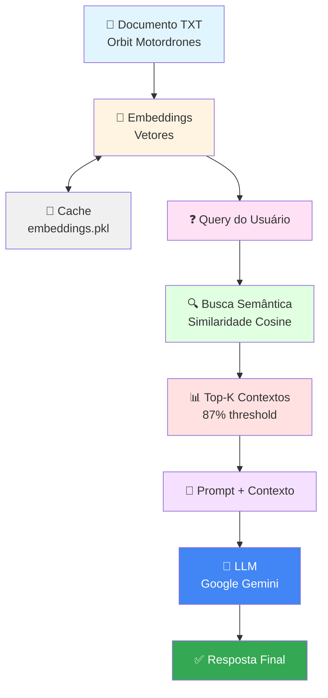

# 🚀 42 São Paulo: Imersão GenAI para Desenvolvedores

Repositório contendo todos os projetos e exercícios desenvolvidos durante a Imersão GenAI para Desenvolvedores na 42 São Paulo.

## 📋 Índice

- [Sobre a Imersão](#sobre-a-imersão)
- [Projetos](#projetos)
  - [Project 1](#project-1)
  - [Project 2](#project-2)
  - [Project 3](#project-3)
  - [Rush GenAI](#rush-genai)
- [Exercícios e Materiais](#exercícios-e-materiais)
- [Tecnologias Utilizadas](#tecnologias-utilizadas)
- [Como Executar](#como-executar)
- [Estrutura do Repositório](#estrutura-do-repositório)

---

## 🎯 Sobre a Imersão

A **Imersão GenAI para Desenvolvedores** é um programa intensivo oferecido pela 42 São Paulo focado em Inteligência Artificial Generativa. Durante a imersão, foram desenvolvidos diversos projetos práticos explorando tecnologias de ponta como:

- 🤖 Modelos de linguagem (LLMs)
- 💬 Chatbots inteligentes
- 🗄️ Bancos de dados vetoriais
- 🔍 Sistemas de busca semântica (RAG)
- 🐳 Containerização com Docker
- 🎨 Interfaces com Streamlit

---

## 📂 Projetos

### Project 1 - Fundamentos de Python

> **Status:** ✅ Completo
> **Repositório:** [EvertonVaz/project1](https://github.com/EvertonVaz/project1)

Módulo introdutório focado nos **fundamentos de Python**, essencial para o desenvolvimento de aplicações com IA Generativa. Contém 9 exercícios práticos progressivos que cobrem desde conceitos básicos até integração com APIs externas.

#### 📚 Exercícios Implementados

<details>
<summary><b>ex01 - Variáveis e Strings</b></summary>

- **Conceitos:** Declaração de variáveis, interpolação com f-strings
- **Arquivo:** `ex01/name.py`
- **Aprendizado:** Trabalhar com tipos básicos e formatação de texto
</details>

<details>
<summary><b>ex02 - Operadores Booleanos</b></summary>

- **Conceitos:** Operadores de comparação (==, >, <)
- **Arquivo:** `ex02/boolean.py`
- **Aprendizado:** Expressões booleanas e comparações
</details>

<details>
<summary><b>ex03 - Listas</b></summary>

- **Conceitos:** Estruturas de dados, iteração com `for`
- **Arquivo:** `ex03/lists.py`
- **Aprendizado:** Manipulação de listas e loops
</details>

<details>
<summary><b>ex04 - Dicionários</b></summary>

- **Conceitos:** Estruturas chave-valor, iteração sobre dicts
- **Arquivo:** `ex04/dicts.py`
- **Aprendizado:** Trabalhar com dicionários e seus métodos
</details>

<details>
<summary><b>ex05 - Argumentos de Linha de Comando</b></summary>

- **Conceitos:** `sys.argv`, captura de argumentos CLI
- **Arquivo:** `ex05/arguments.py`
- **Aprendizado:** Processar entradas via terminal
</details>

<details>
<summary><b>ex06 - Primeira Função</b></summary>

- **Conceitos:** Definição de funções, parâmetros padrão, type hints
- **Arquivo:** `ex06/first_function.py`
- **Aprendizado:** Criar funções reutilizáveis com tipagem
</details>

<details>
<summary><b>ex07 - Saudações da Fazenda</b></summary>

- **Conceitos:** Bibliotecas externas, gerenciamento de dependências
- **Arquivo:** `ex07/greetings_from_the_farm.py`
- **Biblioteca:** `cowsay` (ASCII art)
- **Aprendizado:** Usar `requirements.txt` e bibliotecas de terceiros
</details>

<details>
<summary><b>ex08 - Consulta de Clima</b></summary>

- **Conceitos:** Requisições HTTP, APIs REST, manipulação de JSON
- **Arquivo:** `ex08/weather.py`
- **API:** Open-Meteo (gratuita, sem autenticação)
- **Biblioteca:** `requests`
- **Aprendizado:** Integração com APIs externas
</details>

<details>
<summary><b>ex09 - Documentação</b></summary>

- **Conceitos:** Documentação de código
- **Arquivo:** `ex09/README.md`
- **Aprendizado:** Boas práticas de documentação
</details>

#### 🎯 Objetivos de Aprendizado

- ✅ **Fundamentos Python:** Variáveis, tipos de dados, estruturas de controle
- ✅ **Estruturas de Dados:** Listas, dicionários e iteração
- ✅ **Funções:** Definição, parâmetros, type hints e boas práticas
- ✅ **CLI:** Processamento de argumentos de linha de comando
- ✅ **Dependências:** Gerenciamento com `requirements.txt`
- ✅ **APIs REST:** Requisições HTTP e manipulação de JSON
- ✅ **Boas Práticas:** Documentação, organização de código

#### 🚀 Como Executar

```bash
cd project1

# Exercícios básicos (ex01-ex06)
python ex01/name.py
python ex02/boolean.py
python ex03/lists.py

# Exercícios com dependências
pip install cowsay requests
python ex07/greetings_from_the_farm.py Everton
python ex08/weather.py "São Paulo"
```

---

### Project 2 - Engenharia de Prompts e LLMs

> **Status:** ✅ Completo
> **Repositório:** [EvertonVaz/project2](https://github.com/EvertonVaz/project2)

Módulo avançado focado em **Engenharia de Prompts** e integração com **Large Language Models (LLMs)**. Explora técnicas profissionais de prompting, desde conceitos básicos até estratégias avançadas como Few-Shot Learning, XML Prompting, Role-Play e Prompt Chaining.

#### 📚 Exercícios Implementados

<details>
<summary><b>ex01 - Provedor de API</b></summary>

- **Conceitos:** Escolha de provedor LLM, API Keys, Rate Limits
- **Arquivo:** `ex01/provider.txt`
- **Provedor:** Google Gemini API
- **Aprendizado:**
  - Processo de obtenção de API Key
  - Compreensão de limites (RPM, TPM, RPD)
  - Modelos disponíveis (Gemini 2.5 Pro, Flash, Flash-Lite)
</details>

<details>
<summary><b>ex02 - Primeiro Prompt</b></summary>

- **Conceitos:** Requisições básicas à API, controle de temperatura
- **Arquivo:** `ex02/prompt.py`
- **Tecnologias:** Google Gemini API, python-dotenv
- **Funcionalidades:**
  - Envio de prompts via linha de comando
  - Controle de temperatura (0.0 - 2.0)
  - Tratamento de erros
- **Aprendizado:** Integração básica com LLM e parâmetros de geração
</details>

<details>
<summary><b>ex03 - Few-Shot Learning</b></summary>

- **Conceitos:** Few-Shot Prompting, exemplos contextuais
- **Arquivo:** `ex03/fewshot.py`
- **Técnica:** Fornecer exemplos para guiar o modelo
- **Caso de Uso:** Definição de termos de informática
- **Exemplos fornecidos:**
  - SQL → linguagem de consulta estruturada
  - Python → linguagem de programação de alto nível
  - API → conjunto de definições e protocolos
  - HTTP → protocolo de transferência de hipertexto
- **Aprendizado:** Como ensinar o modelo através de exemplos
</details>

<details>
<summary><b>ex04 - XML Prompting</b></summary>

- **Conceitos:** Estruturação de prompts com XML, templates
- **Arquivo:** `ex04/xml.py`
- **Técnica:** Uso de tags XML para organizar instruções
- **Caso de Uso:** Resumidor de texto (máx. 20 palavras)
- **Estrutura:**
  - `<instructions>`: Diretrizes claras
  - `<exemplos>`: Exemplos de entrada/saída
  - `<texto>`: Conteúdo a processar
- **Aprendizado:** Prompts estruturados melhoram consistência
</details>

<details>
<summary><b>ex05 - Role-Play</b></summary>

- **Conceitos:** Definição de persona, simulação de especialistas
- **Arquivo:** `ex05/roleplay.py`
- **Técnica:** Atribuir papel específico ao modelo
- **Persona:** Consultor de viagens especializado
- **Caso de Uso:** Listar top 5 destinos turísticos por região
- **Estrutura:**
  - `<persona>`: Definição do papel
  - `<instruções>`: Tarefas específicas
  - `<exemplos>`: Paris, Floresta Amazônica
- **Aprendizado:** Personas direcionam o tom e expertise das respostas
</details>

<details>
<summary><b>ex06 - Structured Output</b></summary>

- **Conceitos:** Saída estruturada, validação com Pydantic
- **Arquivo:** `ex06/structured.py`
- **Tecnologias:** Pydantic BaseModel, JSON Schema
- **Caso de Uso:** Extração de informações de pessoa
- **Schema:**
  ```python
  class Pessoa(BaseModel):
      nome: str
      idade: int
      profissão: str
      cidade: str
  ```
- **Aprendizado:** Garantir formato consistente e validado das respostas
</details>

<details>
<summary><b>ex07 - Prompt Chaining</b></summary>

- **Conceitos:** Encadeamento de prompts, pipeline de processamento
- **Arquivo:** `ex07/chaining.py`
- **Técnica:** Usar output de um prompt como input do próximo
- **Pipeline:**
  1. **Expansão:** Gera descrição detalhada do produto (~50 palavras)
  2. **Criatividade:** Converte em anúncio publicitário com emojis
  3. **Tradução:** Traduz resultado final para inglês
- **Aprendizado:** Dividir tarefas complexas em etapas simples
</details>

#### 🎯 Objetivos de Aprendizado

- ✅ **API Integration:** Configuração e uso do Google Gemini API
- ✅ **Prompt Engineering:** Técnicas profissionais de construção de prompts
- ✅ **Few-Shot Learning:** Ensinar modelos através de exemplos
- ✅ **Structured Prompting:** XML e formatação para melhor controle
- ✅ **Role-Playing:** Definição de personas para contexto especializado
- ✅ **Output Validation:** Schemas Pydantic para respostas estruturadas
- ✅ **Prompt Chaining:** Pipelines de processamento multi-etapa
- ✅ **Temperature Control:** Ajuste de criatividade vs. determinismo
- ✅ **Error Handling:** Tratamento robusto de exceções

#### 🛠️ Tecnologias

- **LLM:** Google Gemini 2.5 Flash
- **SDK:** `google-genai` (oficial)
- **Validação:** Pydantic BaseModel
- **Ambiente:** python-dotenv
- **Containerização:** Docker Compose (Ollama local)

#### 🚀 Como Executar

```bash
cd project2

# Configurar API Key
echo "GOOGLE_API_KEY=sua_chave_aqui" > .env

# Instalar dependências
pip install -r requirements.txt

# Executar exercícios
python ex02/prompt.py "Explique IA em uma frase" 1.0
python ex03/fewshot.py "Docker"
python ex04/xml.py "A fotossíntese é o processo pelo qual plantas convertem luz solar em energia"
python ex05/roleplay.py "Tokyo"
python ex06/structured.py "João Silva, 35 anos, é engenheiro e mora em SP"
python ex07/chaining.py "Smartphone com câmera 108MP"

# Ollama local (opcional)
docker-compose up -d
```

#### 📊 Rate Limits - Google Gemini (Free Tier)

| Modelo | RPM | TPM | RPD |
|--------|-----|-----|-----|
| Gemini 2.5 Pro | 5 | 125.000 | 100 |
| Gemini 2.5 Flash | 10 | 250.000 | 250 |
| Gemini 2.5 Flash-Lite | 15 | 250.000 | 1.000 |
| Gemini 2.0 Flash | 15 | 1.000.000 | 200 |
| Gemini 2.0 Flash-Lite | 30 | 1.000.000 | 200 |

*RPM = Requests Per Minute | TPM = Tokens Per Minute | RPD = Requests Per Day*

---

### Project 3 - Chatbots Avançados e RAG

> **Status:** ✅ Completo
> **Repositório:** [EvertonVaz/project3](https://github.com/EvertonVaz/project3)

Módulo avançado focado em **Chatbots com Memória** e **Retrieval Augmented Generation (RAG)**. Explora conceitos de persistência de conversas, embeddings vetoriais, busca semântica e sistemas RAG completos.

#### 📚 Exercícios Implementados

<details>
<summary><b>ex01 - Chatbot Básico com Histórico</b></summary>

- **Conceitos:** Chatbot conversacional, histórico em memória
- **Arquivo:** `ex01/chatbot.py`
- **Funcionalidades:**
  - Loop de conversação interativo
  - Histórico das últimas 5 mensagens
  - Respostas concisas (máx. 10 palavras)
  - Comando `bye` para encerrar
- **Tecnologias:** Google Gemini Flash Lite
- **Aprendizado:** Gerenciamento básico de contexto conversacional
</details>

<details>
<summary><b>ex02 - Chatbot Persistente com Banco de Dados</b></summary>

- **Conceitos:** Persistência de conversas, resumos automáticos, arquitetura modular
- **Arquivos:**
  - `persistent_chatbot.py` - Lógica principal do chatbot
  - `database.py` - Repositório e acesso ao banco
  - `models.py` - Modelos SQLAlchemy (Message, Summary)
  - `schemas.py` - Schemas Pydantic para validação
- **Funcionalidades:**
  - ✅ **Persistência:** SQLite para histórico permanente
  - ✅ **Resumos Automáticos:** Geração a cada 10 mensagens
  - ✅ **Contexto Inteligente:** Últimas 5 mensagens + resumos
  - ✅ **Persona Definida:** Assistente empático e prestativo
  - ✅ **Respostas Concisas:** Máximo 25 palavras
- **Arquitetura:**
  ```
  ex02/
  ├── persistent_chatbot.py  # Classe PersistentChatbot
  ├── database.py            # MessageRepository
  ├── models.py              # Message, Summary (SQLAlchemy)
  └── schemas.py             # MessageData, SummaryData (Pydantic)
  ```
- **Tecnologias:** SQLAlchemy, Pydantic, SQLite
- **Aprendizado:** Arquitetura robusta com separação de responsabilidades
</details>

<details>
<summary><b>ex03 - Embeddings e Similaridade Semântica</b></summary>

- **Conceitos:** Embeddings vetoriais, busca por similaridade
- **Arquivo:** `ex03/embeddings.py`
- **Modelo:** `paraphrase-multilingual-MiniLM-L12-v2`
- **Funcionalidades:**
  - Geração de embeddings para textos em português
  - Cálculo de similaridade cosine
  - Busca dos top-3 textos mais similares
  - Dataset com 14 frases de diferentes tópicos
- **Exemplo de Uso:**
  ```bash
  python ex03/embeddings.py "inteligência artificial"
  # Retorna: frases sobre IA, tecnologia, Python
  ```
- **Aprendizado:** Fundamentos de busca semântica e embeddings
</details>

<details>
<summary><b>ex04 - Sistema RAG Completo</b></summary>

- **Conceitos:** Retrieval Augmented Generation, cache de embeddings
- **Arquivo:** `ex04/rag.py`
- **Dataset:** `orbit_motordrones.txt` (documento sobre VAPs)
- **Funcionalidades:**
  - 🔍 **Busca Semântica:** Recupera linhas relevantes do documento
  - 💾 **Cache Inteligente:** Salva embeddings em disco (pickle)
  - 🎯 **Threshold Dinâmico:** Filtra por 87% da similaridade máxima
  - 🤖 **Geração Aumentada:** LLM responde com contexto recuperado
- **Pipeline RAG:**
  1. **Indexação:** Gera embeddings de todas as linhas do documento
  2. **Retrieval:** Busca linhas similares à query do usuário
  3. **Augmentation:** Injeta contexto no prompt
  4. **Generation:** LLM responde baseado no contexto
- **Otimizações:**
  - Cache persistente de embeddings (evita reprocessamento)
  - Threshold adaptativo para melhor precisão
  - Temperatura baixa (0.4) para respostas factuais
- **Exemplo de Uso:**
  ```bash
  python ex04/rag.py "Qual o preço do Orbit Family?"
  # RAG recupera informações de preço e responde
  ```
- **Aprendizado:** Implementação completa de sistema RAG profissional
</details>

#### 🎯 Objetivos de Aprendizado

- ✅ **Chatbot Conversacional:** Loop de interação e gestão de contexto
- ✅ **Persistência de Dados:** SQLAlchemy com SQLite
- ✅ **Arquitetura Modular:** Separação de camadas (chatbot, database, models, schemas)
- ✅ **Resumos Automáticos:** Compactação inteligente de histórico
- ✅ **Embeddings Vetoriais:** Representação numérica de textos
- ✅ **Busca Semântica:** Similaridade cosine e ranking
- ✅ **Sistema RAG:** Retrieval + Augmented Generation completo
- ✅ **Cache Optimization:** Persistência de embeddings para performance
- ✅ **Threshold Tuning:** Ajuste fino de relevância
- ✅ **Persona Design:** Definição de tom e comportamento do assistente

#### 🛠️ Tecnologias

- **LLM:** Google Gemini 2.5 Flash Lite
- **Embeddings:** Sentence-Transformers (`paraphrase-multilingual-MiniLM-L12-v2`)
- **ORM:** SQLAlchemy 2.0
- **Validação:** Pydantic BaseModel
- **Database:** SQLite
- **Cache:** Pickle (serialização Python)
- **ML Framework:** PyTorch (via sentence-transformers)

#### 📊 Arquitetura do Sistema RAG (ex04)



#### 🚀 Como Executar

```bash
cd project3

# Configurar API Key
echo "GOOGLE_API_KEY=sua_chave_aqui" > .env

# Instalar dependências (inclui PyTorch)
pip install -r requirements.txt

# ex01 - Chatbot básico
python ex01/chatbot.py
# Digite suas perguntas. Digite 'bye' para sair.

# ex02 - Chatbot persistente
cd ex02
python persistent_chatbot.py
# Conversas são salvas em chat_history.db

# ex03 - Teste de embeddings
cd ../ex03
python embeddings.py "tecnologia"
python embeddings.py "futebol"
python embeddings.py "natureza"

# ex04 - Sistema RAG
cd ../ex04
python rag.py "Quais são os modelos da Orbit?"
python rag.py "Qual o preço do Orbit Family?"
python rag.py "Quem é o CEO da Orbit?"
```

#### 💡 Destaques Técnicos

**ex02 - Chatbot Persistente:**
- Repository Pattern para abstração de dados
- Resumos gerados automaticamente com prompt XML estruturado
- Gestão inteligente de contexto (histórico + resumos)
- Schemas Pydantic garantem validação de tipos

**ex04 - Sistema RAG:**
- Cache persistente evita reprocessamento (speedup ~100x)
- Threshold adaptativo: 87% da max similarity
- Modelo multilingual suporta português naturalmente
- Temperature 0.4 para respostas mais factuais

---

### Rush GenAI

> **Status:** ✅ Completo
> **Repositório:** [EvertonVaz/rush_genai](https://github.com/EvertonVaz/rush_genai)

Projeto principal da imersão: **Velinha da Locadora** 👵 - Um chatbot inteligente de recomendação de filmes.

#### 🎬 Sobre o Projeto

Sistema completo de recomendação de filmes utilizando IA Generativa, banco de dados vetorial (ChromaDB) e persistência de conversas. O chatbot simula uma simpática "velinha" de locadora que conhece bem seu acervo e ajuda usuários a encontrar filmes perfeitos para assistir.

#### ⚡ Funcionalidades

- **💬 Chatbot Conversacional**: Interface natural com histórico de conversas persistente
- **🔍 Busca Semântica**: Sistema RAG (Retrieval Augmented Generation) com ChromaDB
- **📊 Banco de Dados Vetorial**: Embeddings de filmes para busca inteligente
- **💾 Persistência**: SQLite para histórico de mensagens e preferências do usuário
- **📝 Resumos Automáticos**: Geração de resumos do histórico de conversas
- **⭐ Sistema de Favoritos**: Gerenciamento de filmes favoritos do usuário
- **🎯 Avaliações**: Registro de notas e filmes assistidos
- **🎨 Interface Web**: Aplicação Streamlit para interação amigável

#### 🛠️ Tecnologias

- **LLM**: Google Gemini 2.5 Flash Lite
- **Vector DB**: ChromaDB (busca por similaridade)
- **Backend**: Python, SQLAlchemy, Pydantic
- **Frontend**: Streamlit
- **Database**: SQLite

#### 📁 Arquitetura

```
rush_genai/
├── chatbot/
│   ├── chatbot.py       # Lógica principal do chatbot
│   ├── database.py      # Repositórios e acesso ao banco
│   ├── models.py        # Modelos SQLAlchemy
│   └── schemas.py       # Schemas Pydantic
├── chroma_db/           # Banco de dados vetorial
├── main.py              # Aplicação Streamlit
├── process_json.py      # Processamento e ingestão de dados
└── movies.json          # Dataset de filmes
```

#### 🎯 Principais Características Técnicas

1. **Sistema RAG Inteligente**
   - Busca semântica nos top 3 filmes mais relevantes
   - Embeddings automáticos com ChromaDB
   - Context window otimizado para melhor resposta

2. **Gerenciamento de Contexto**
   - Histórico das últimas 5 mensagens
   - Resumos automáticos a cada 10 mensagens
   - Memória de longo prazo através de resumos

3. **Function Calling**
   - `get_favorites()`: Lista filmes favoritos
   - `add_to_favorites(movie_id, titulo)`: Adiciona favorito
   - `set_rating(movie_id, rating)`: Define nota (0-10)
   - `get_rating(movie_id)`: Consulta nota
   - `set_watched(movie_id)`: Marca como assistido
   - `check_watched(movie_id)`: Verifica se assistiu
   - `exit()`: Encerra conversa

4. **Prompting Avançado**
   - Persona definida (crítico de cinema experiente e bondoso)
   - Instruções contextuais detalhadas
   - Integração de histórico e resumos no prompt

#### 🚀 Como Executar

```bash
# Instalar dependências
pip install -r requirements.txt

# Configurar variável de ambiente
echo "GOOGLE_API_KEY=sua_chave_aqui" > .env

# Executar aplicação Streamlit
streamlit run rush_genai/main.py
```

---

## 🛠️ Tecnologias Utilizadas

### Linguagens e Frameworks
-  **Python 3.10+**
-  **Streamlit** - Interface web
-  **SQLAlchemy** - ORM

### IA e Machine Learning
-  **Google Gemini API** - LLM
- **ChromaDB** - Banco de dados vetorial
- **Sentence Transformers** - Embeddings
- **Pydantic** - Validação de dados

### Ferramentas
-  **Docker** - Containerização
-  **Git** - Controle de versão
- **SQLite** - Banco de dados relacional
- **Ollama** - Modelos locais

---

## 🚀 Como Executar

### Pré-requisitos

```bash
# Python 3.10 ou superior
python --version

# Git
git --version

# Docker (opcional)
docker --version
```

### Instalação

```bash
# Clonar repositório com submódulos
git clone --recursive https://github.com/EvertonVaz/genAIDev.git
cd genAIDev

# Instalar dependências
pip install -r requirements.txt

# Configurar variável de ambiente
cp .env.example .env
# Editar .env e adicionar sua GOOGLE_API_KEY
```

### Executar Projetos

```bash
# Rush GenAI (Chatbot de Filmes)
streamlit run rush_genai/main.py

# Ollama Local (Módulo 2)
docker-compose -f subjects/modulo2-docker-compose.yml up -d
```

---

## 📂 Estrutura do Repositório

```
genAIDev/
├── project1/              # Submodule - Projeto 1
├── project2/              # Submodule - Projeto 2
├── project3/              # Submodule - Projeto 3
├── rush_genai/            # Submodule - Projeto Principal
│   ├── chatbot/           # Módulo do chatbot
│   │   ├── chatbot.py     # Lógica do chatbot
│   │   ├── database.py    # Camada de dados
│   │   ├── models.py      # Modelos do banco
│   │   └── schemas.py     # Schemas Pydantic
│   ├── chroma_db/         # Banco vetorial
│   ├── main.py            # App Streamlit
│   ├── process_json.py    # Processamento de dados
│   ├── movies.json        # Dataset de filmes
│   ├── cli.py             # CLI
│   └── .gitignore         # Arquivos ignorados
├── subjects/              # Materiais dos módulos
│   ├── modulo2-docker-compose.yml  # Config Docker Ollama
│   └── modulo3-orbit_motordrones.txt  # Dataset Orbit
├── requirements.txt       # Dependências Python
├── .gitmodules           # Configuração dos submódulos
└── README.md             # Este arquivo
```

---

## 🎓 Aprendizados

Durante esta imersão, foram explorados conceitos fundamentais de IA Generativa:

### 1. **Large Language Models (LLMs)**
- Utilização da API Google Gemini
- Técnicas de prompting avançado
- Function calling e ferramentas

### 2. **Retrieval Augmented Generation (RAG)**
- Implementação de busca semântica
- Uso de bancos de dados vetoriais
- Embeddings e similaridade

### 3. **Engenharia de Software**
- Arquitetura modular e escalável
- Persistência de dados
- Boas práticas com Python

### 4. **DevOps**
- Containerização com Docker
- Gerenciamento de dependências
- Versionamento com Git

---

## 👤 Autor

**Everton Vaz**

- GitHub: [@EvertonVaz](https://github.com/EvertonVaz)
- 42 São Paulo

---

## 📝 Licença

Este projeto foi desenvolvido como parte da Imersão GenAI da 42 São Paulo para fins educacionais.

---

## 🙏 Agradecimentos

- **42 São Paulo** pela oportunidade e infraestrutura
- **Comunidade Open Source** pelas ferramentas utilizadas

---

<div align="center">

**Feito com ❤️ durante a Imersão GenAI na 42 São Paulo**

[⬆ Voltar ao topo](#-42-são-paulo-imersão-genai-para-desenvolvedores)

</div>
